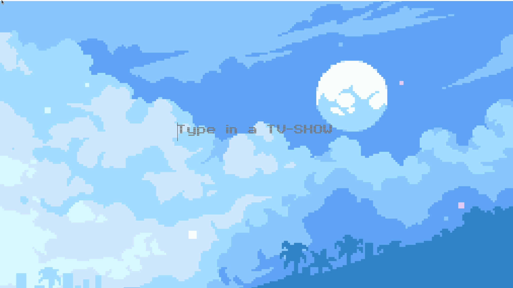
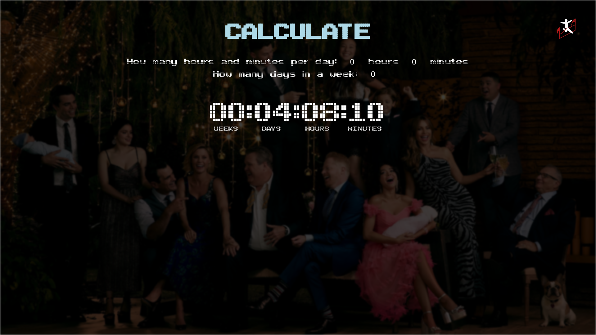

# TV-SHOW PLANNER
#### Video Demo: https://www.youtube.com/watch?v=IEzx8xmD_gI&ab_channel=SanyamSachdeva
### Description:
This website is a TV show, total time calculator and planner, the user can search the name of any TV show and will be provided with the total time it would take to complete this show in one sitting, Also, the user would be provided with three forms, which essentially be asking the user to tell for how many hours and minutes are they planning to watch this show in a day, and for how many times in a week, and it will then calculate how many weeks, days, hours and minutes it would take to complete it, which is the main purpose of this website, and on the second page of the website on the top right corner, a symbol is represented to showcase the status, a running stickman represents that show is still running and another symbol is stickman finishing the race, which means the show ended, 

### Tech stack
This project is written in HTML, CSS, JavaScript and Python's web framework FLASK. It uses the TMDb API to get information about the show status, episode runtime, and show's images.

### Design
I used a pixelated image of a sky for the background of the first page, and there is a search bar centre-aligned, the font used for the search bar is a pixel font, which I don't remember where I got from.

For the second page, I used the image I got from an API call, this image is different for every search, so I put a black shade on the image and blurred it to 2 pixels, so the runtime data can be easily seen. I try to maintain the same theme by using the pixel font and light blue colour for the font.

The timer which shows weeks, days, hours and minutes, starts from 0 and gets to the final value, it increments by one and shows it simultaneously to give it a great effect.

Something that is out of convention that I did for styling is to use style tags in html file, it was important to make an API call for the background image, as to make the API call, it needed the tv-show ID, which was filled dynamically with the help of jinja, which wasn't possible in a separate CSS file, even though there were other alternatives to do that, but I found them complex and not worth it.

### Features
#### Auto-complete search bar
I have implemented an auto-complete search bar, which suggests the user's TV shows based on the input the user typed. It is implemented in javascript and uses AJAX, this function gets triggered every time the user inputs anything, the function deletes any whitespace, and checks if the user inputs anything, now with the search term as the query, it makes the API call, then the results it gets are sent to another function, which displays the result in an unordered list of links, the ID of the show is sent to next page with GET request hidden in an input box. To make it more aesthetic the search bar autocapitalizes the user input, by first splitting the word with " " space, and then using toUpperCase() on the first character of each word.

#### Total time timer
when the user gets to the second page, the user is presented with a timer showing how much time it would take to complete the TV show in one sitting in weeks, days, hours and minutes. which is calculated by multiplying the average of the TV show's episode runtime by a total number of episodes, and then divided into weeks, days, hours, and minutes in Flask. 

#### Calculated time
This function calculates time based on the user's input on how many hours the user wants to watch the show and how many times in a week, this is the core of this website, and it was implemented in javascript. 

### Getting started
This website is yet to released.

### Usage
I think this project is highly useful for two entirely different purposes, first the user can know how much time it would take to complete the show according to their schedule, on the other hand, what I have noticed is some TV show can span over several weeks, seeing so much weeks can make the user think if the TV show is even worth watching, as it would take commitment to do so, after knowing that how much time it would take.